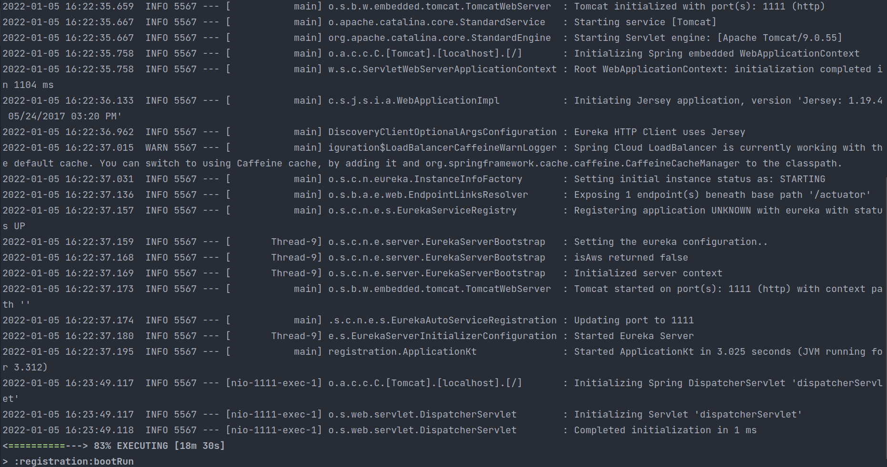

# Primary Goal

#### The two services `accounts (2222)` and `web` are running and registered.


* Before launching both services, Eureka server has to be running. That can be done with the following command: 
  ```
  ./gradlew :registration:bootRun
  ```
* Launching Account service:
  ```
  ./gradlew :accounts:bootRun
  ```
  

* Launching Web service:
  ```
  ./gradlew :web:bootRun
  ```
  

#### The service registration service has these two services registered 

If we visit `http://localhost:1111` we can check if the services have been registered




#### A second accounts service instance is started and will use the port 4444

In order to use the port 4444, the field port in the `accounts/src/main/resources/application.yml`
file needs to be modified appropriately  


#### What happens when you kill the service accounts (2222) and do requests to web?
#### Can the web service provide information about the accounts again? Why?

If service accounts (2222) is killed it will be removed from the Eureka dashboard


If we are fast enough, we can do a request to web and be redirected to the killed service. Once Eureka discovers that 
the service no longer exists it starts redirecting to accounts (4444).


The magic behinds resides in the communication between the web server and Eureka. More precisely in the web/src/main/java/web/config/WebServerConfiguration.java 
file where it uses a logical name to refer to the account-service that is then converted to a real one by Eureka
